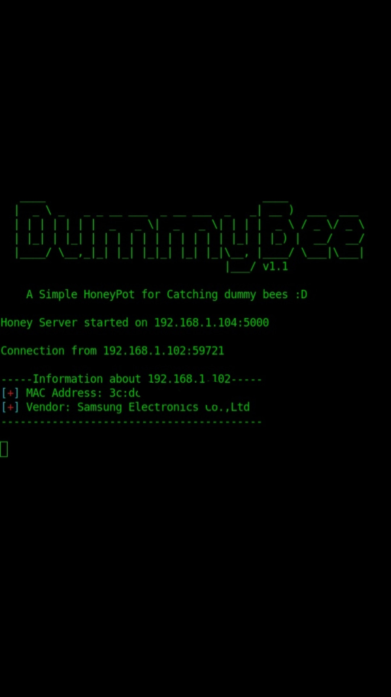
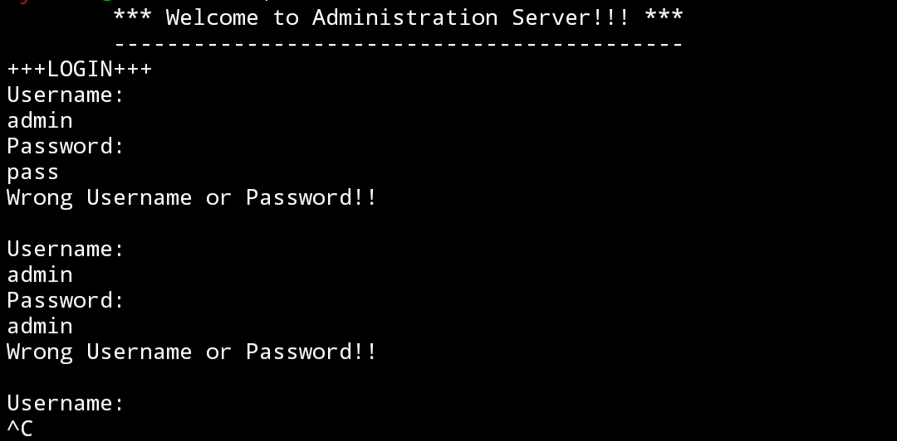

# DummyBee v1.2

# Lang: EN
A simple honeypot written with ruby and python scripting language.
Distract intruders with unlimited login screen.
- Usage: ```sudo ruby DummyBee.rb [host] [port]```<br>
[host]: <i>Your local ip address e.g. 192.168.1.154</i><br>
[port]: <i>Specific port e.g. 5555</i>

# Added new 23/01/2020
- Now you can log your honeypot connections.

# Lang: TR
Ruby ve python scripting dili ile geliştirilmiş basit bir HoneyPot yazılımı.
Ağınızdaki davetsiz misafirleri sonsuz bir login döngüsü ile şaşırtıp 
o esnada cihaz bilgilerini alın.
- Kullanım: ```sudo ruby DummyBee.rb [yerel ip] [port]```<br>
[yerel ip]: <i>Yerel ağdaki ip adresi örn. 192.168.1.154</i><br>
[port]: <i>Bağlantının dinleneceği keyfi port numarası örn. 5555</i>

# Yenilikler 23/01/2020
- Artık gelen bağlantılar ve bağlantıyı yapan cihazların
bilgileri kayıt altına alınacak.( kısaca log tutma :D )

# Screenshots/Ekran görüntüleri



# Contact/İletişim
- Linkedin: ```https://www.linkedin.com/in/mehmetalikerimoglu```
- E-mail: ```cyb3rmx0@gmail.com```
